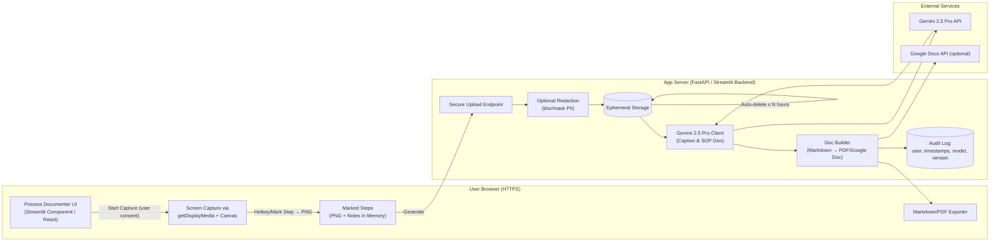

# Process Documenter App

## Overview

**Purpose:**  
The Process Documenter app enables users to **record a workflow or training process**, automatically capture screenshots at the right moments, and generate **step-by-step documentation** describing each action.  

It helps accounting and finance teams quickly document complex procedures such as:
- Preparing journal entries  
- Posting accruals or prepaids  
- Running monthly close reports  
- Uploading data to ERP systems  

The goal is to save hours of manual documentation time, ensure repeatability, and improve auditability across finance operations.

---

## How It Works (User Flow)

1. **Start Recording**
   - The user visits the app in a secure browser (HTTPS only).
   - Clicks **“Start Capture”** to select a window, tab, or application screen to record.  
   - Screen sharing permission is granted through the browser’s native UI (via `getDisplayMedia`).

2. **Capture Steps**
   - While demonstrating the process, the user presses a **hotkey (e.g., Ctrl+Shift+S)** or clicks a **“Mark Step”** button each time a significant action occurs.
   - The app takes a **screenshot** of the selected window at that exact moment.  
   - Optional: the user can add a short note describing what they just did (e.g., “Posted JE for Payroll Accruals”).

3. **Finish & Generate**
   - When done, the user clicks **“Finish Session.”**
   - The app sends the collected screenshots (and optional notes) to an AI model (Gemini 2.5 Pro) that:
     - Describes each screenshot in clear, imperative language (“Click ‘New Journal Entry’ in NetSuite”).
     - Orders them chronologically.
     - Generates a structured Markdown document with:
       - Process title and purpose  
       - Prerequisites  
       - Numbered step-by-step actions  
       - Optional “why this step matters” explanations  

4. **Download or Export**
   - The resulting documentation can be:
     - Viewed directly in the browser,
     - Downloaded as a **PDF**, **Markdown**, or **Google Doc**, or
     - Copied into internal wikis (Confluence, Notion, etc.).
   - Screenshots are displayed inline beside their AI-generated descriptions.

---

## Core Technologies

| Component | Tool | Purpose |
|------------|------|----------|
| **Frontend UI** | Streamlit (Python) or lightweight React/Next.js frontend | Browser interface for recording and previewing steps |
| **Screen Capture** | `navigator.mediaDevices.getDisplayMedia()` (WebRTC API) | Secure, user-consented screen capture |
| **Snapshot Capture** | `<canvas>` element + `toBlob()` | Captures still frames on demand when user marks a step |
| **AI Captioning & Document Generation** | Gemini 2.5 Pro API | Generates step-by-step text and structured documentation |
| **Document Export** | Markdown → PDF/Google Docs via `pypandoc` or Google Docs API | User downloads or exports documentation |
| **Optional Backend** | FastAPI / Streamlit server functions | Receives uploaded screenshots, calls Gemini API, deletes temp data |
| **Data Storage** | Temporary in memory or encrypted short-term storage | Deleted automatically after generation |

---

## Key Features

- **Event-driven Capture:** Only snapshots at user-designated moments (no continuous video).
- **AI-Generated Steps:** Gemini interprets screenshots and outputs concise, accurate instructions.
- **Multi-format Export:** Markdown, PDF, or Google Doc outputs ready for SOP libraries.
- **Audit Trail:** Each document includes metadata (timestamps, model used, version, generation time).
- **No Installation Required:** Runs entirely in the browser; no extensions or desktop apps.
- **Extensible:** Can be adapted later for automatic DOM-based or click-based screenshot triggers.

---

## Security & Privacy Considerations

### 1. User Consent & Control
- Uses the browser’s built-in `getDisplayMedia` API (part of WebRTC).  
- The browser **always** prompts the user to choose which screen, window, or tab to share.
- Recording can be stopped at any time via the browser’s “Stop sharing” button.

### 2. Data Flow
- By default, all screenshots are held **locally in browser memory** until the user clicks **“Generate.”**
- If server-side AI processing is enabled:
  - Images are uploaded via HTTPS to a temporary, encrypted store.
  - Processing jobs call the Gemini API.
  - All files are deleted automatically after the document is returned (configurable retention ≤1 hour).

### 3. No Background Capture
- The app cannot record without the user’s explicit interaction.
- There is always a visible indicator (browser-native “Screen is being shared” notification).

### 4. Network & Hosting
- Host on a secure, internal domain (HTTPS).
- Enforce:
  - TLS 1.2+,
  - Strict Content Security Policy,
  - No third-party analytics or tracking scripts.
- Use SSO (Okta, Google Workspace) if deployed inside an enterprise environment.

### 5. Data Redaction (Optional)
- Before upload, screenshots can be **blurred or masked** client-side to hide PII, financial data, or sensitive UI elements.

### 6. Audit & Logging
- Keep a small metadata log (who generated, when, model name, model version).
- No raw screen content is stored long-term.

### 7. Enterprise Considerations

#### Data Privacy & Security (Production Requirements)

**Current Prototype Limitations:**
- Screenshots and audio sent to Google's Gemini API
- No user authentication or access controls
- Data stored temporarily in browser memory only
- No audit trails or compliance logging

**Enterprise Production Requirements:**

##### 1. Data Privacy Controls
- **On-Premises AI Processing**: Deploy AI models locally to avoid sending sensitive data to external APIs
- **Data Redaction**: Implement automatic PII/financial data detection and blurring before processing
- **Encryption**: End-to-end encryption for all data in transit and at rest
- **Data Residency**: Ensure data never leaves approved geographic regions

##### 2. Access Control & Authentication
- **Single Sign-On (SSO)**: Integrate with corporate identity providers (Okta, Azure AD, etc.)
- **Role-Based Access**: Different permission levels for recording, viewing, and managing documentation
- **Multi-Factor Authentication**: Required for all users accessing sensitive financial processes
- **Session Management**: Automatic timeout and secure session handling

##### 3. Compliance & Audit
- **Audit Logging**: Complete audit trail of who recorded what, when, and where
- **Data Retention Policies**: Automatic deletion of recordings after specified periods
- **Compliance Reporting**: Built-in reports for SOX, GDPR, and other regulatory requirements
- **Change Management**: Version control and approval workflows for process documentation

##### 4. Infrastructure Security
- **Network Isolation**: Deploy in private networks with restricted internet access
- **Container Security**: Use secure, scanned container images with minimal attack surface
- **Database Security**: Encrypted databases with proper access controls
- **Backup & Recovery**: Secure, encrypted backups with tested recovery procedures

##### 5. Operational Controls
- **Monitoring**: Real-time monitoring of system usage and potential security incidents
- **Incident Response**: Automated alerts and response procedures for security events
- **Regular Security Audits**: Quarterly penetration testing and vulnerability assessments
- **Staff Training**: Regular security awareness training for all users

##### 6. Data Governance
- **Data Classification**: Automatic classification of captured content (public, internal, confidential, restricted)
- **Approval Workflows**: Multi-level approval for sensitive process documentation
- **Data Loss Prevention**: Automated detection and prevention of sensitive data exfiltration
- **Third-Party Risk**: Vendor security assessments and ongoing monitoring

**Implementation Priority:**
1. **Phase 1**: Authentication, encryption, and basic audit logging
2. **Phase 2**: Data redaction and on-premises AI processing
3. **Phase 3**: Advanced compliance features and monitoring
4. **Phase 4**: Full enterprise governance and risk management

### 8. Architecture

#### High-Level Component Flow


#### User Interaction Sequence

```mermaid
sequenceDiagram
  participant U as User
  participant UI as Browser UI
  participant CAP as "Screen Capture<br/>(getDisplayMedia + Canvas)"
  participant S as Server Backend
  participant G as Gemini 2.5 Pro
  participant D as Doc Exporter

  U->>UI: Open app (HTTPS, SSO optional)
  U->>UI: Click "Start Capture"
  UI->>CAP: Request screen share (browser picker)
  CAP-->>U: User selects window/tab (consent)
  U->>UI: Performs workflow steps
  U->>UI: Press hotkey / "Mark Step"
  UI->>CAP: Grab still frame → PNG
  CAP-->>UI: Store {PNG, timestamp, note} in memory (local)
  loop Repeat per step
    U->>UI: Mark step again
    UI->>CAP: Snapshot → PNG
  end
  U->>UI: Click "Finish & Generate"
  UI->>S: Upload PNGs + notes (HTTPS)
  S->>S: (Optional) Redact/blur sensitive regions
  S->>G: Prompt with images for step captions/SOP
  G-->>S: Structured steps (Markdown/JSON)
  S->>D: Assemble Markdown → PDF/Google Doc
  D-->>UI: Return doc (download/preview link)
  S->>S: Write audit metadata (no content)
  S->>S: Auto-delete temp files per retention policy
```



---

## Example Output (Markdown Excerpt)

```markdown
# Process: Create Monthly Accrual Entry

**Purpose:** Record monthly accruals for software expenses.

**Prerequisites:** Access to NetSuite, GL account 6001, accounting period open.

## Steps

1. **Open the NetSuite Home Page**  
   _Screenshot_  
   The user navigates to Transactions → Financial → Make Journal Entries.

2. **Click “New”**  
   _Screenshot_  
   Opens a blank Journal Entry form.

3. **Enter Subsidiary and Period**  
   _Screenshot_  
   Select “US Entity” and “September 2025” from the dropdown menus.

4. **Input Debit and Credit Lines**  
   _Screenshot_  
   Debit Software Expense (6001) $12,000; Credit Accrued Liabilities (2100).

5. **Save and Close**  
   _Screenshot_  
   Click “Save” to post the entry; confirm JE ID appears in confirmation message.


